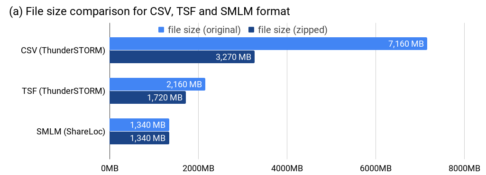
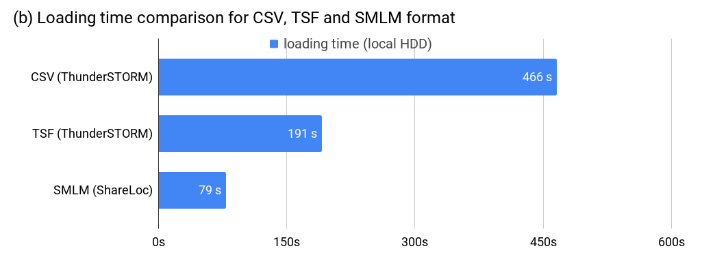
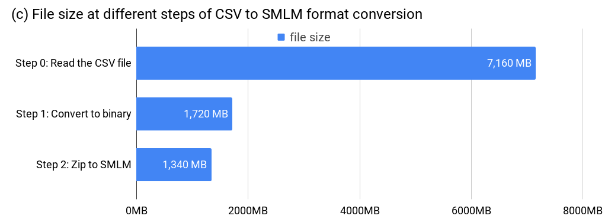
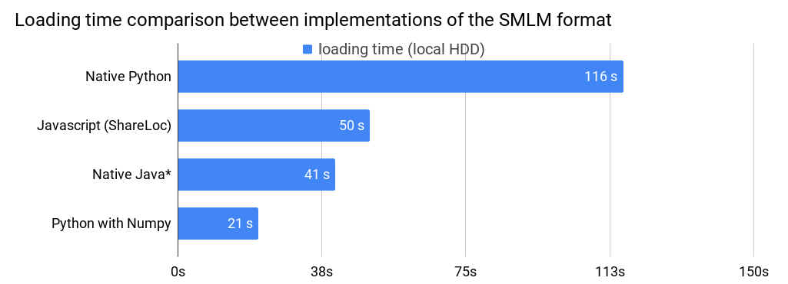

# The SMLM file format
#### A portable and extendable file format for storing and sharing localization microscopy data.

## Key features
 * lossless compression (using standard ZIP)
 * smaller file size (convert a 7.2 GB `.csv` to 1.3 GB `.smlm` file)
 * portable format (many tables in one file, supports multi-channel, tiled-acquisition etc.)
 * fast loading time (fast transmission with small file size)
 * easy to implement (provide examples in Javascript, Python, and Java)
 * visualization with the web app (3D rendering, works for mobile devices, no installation required)
 * flexible and extendable format (customized headers, formats)
 * support meta information (store sample information in readable text format)
 * fast preview with thumbnail support (thumbnail can be retrieved without unzipping the whole file)

## ThunderSTORM Plugin
For supporting import and export as SMLM file format, we developed a ThunderSTORM Plugin which can be downloaded in the [releases](https://github.com/imodpasteur/smlm-file-format/releases). In order to make it work, you need also the ThunderSTORM plugin. Once you installed the SMLM file format plugin, you will be able to choose the "SMLM File" option when you are importing and exporting with ThunderSTORM. See [here](https://github.com/imodpasteur/smlm-file-format/tree/master/implementations/Java/ThunderSTORM) for more details about the plugin.

## Benchmarks

We generated a localization table with 60,000 frames and ~47.8 million localizations from a DNA-PAINT experiment on mouse cells with Vimentin labeled. The table is generated from a ThunderSTROM plugin installed in Fiji. On the same computer (iMac 2017 with 3.4 GHz Intel Core i5, 32 GB memory), we first import the `CSV` file into ThunderSTROM and export it as `TSF` format. On the same computer, we import the same `CSV` file into our web app served on  [ShareLoc.xyz](https://shareLoc.xyz/#/viewer) in a web browser(Chrome) and export the table as `SMLM` format. File size and loading time ware measured.

 * (a) shows a comparison on the file size of these three different file formats. While the `CSV` file is 7,160 MB, and the `TSF` file is 2,610 MB, the corresponding `SMLM` file is 1,340 MB. Notice that although both `CSV` and `TSF` can be both zipped in order to achieve smaller file size, but their sizes are still much bigger than the `SMLM` file;

 * (b) shows a comparison on loading time. Despite that the `SMLM` file has an additional decompression process compare to `CSV` and `TSF`, the loading time test shows it is still much faster to read. For files located on a local hard disk drive, the loading time are 466s, 191s and 79s for `CSV`, `TSF` and `SMLM` respectively.

 * \(c\) illustrates how the file size changed during the two step compression in `SMLM` file format conversion. The `CSV` file is first converted to a binary file with 1,720 MB stored with float32 data type, and then zipped into a small `SMLM` file with 1,340 MB.  

 All the file formats and conversions are lossless, the content of the localization table are checked by comparing the consistency of rendered histogram images. The same experiment has been done with other data files which yields similar performance.

 **Update 1:** With a recent improvement for handling large files, you can now load the smlm file on [ShareLoc.xyz](https://shareloc.xyz) with all modern browsers including Chrome, Firefox and Safari.

 For more detailed usage about ImJoy, go [here](https://github.com/oeway/ImJoy/blob/master/README.md).

## Specification
Please go to the [specification](specification.md) page.

## Implemetations

The SMLM file format is designed to be easily implemented, to demonstrate that, we provide example implementations including in `Javascript`, `Python` and `Java`. Please find them in the [implementations](./implementations) directory.

For using a small SMLM file, we compared the loading time with different implementation of the SMLM file format.

\* The loading time of the Native Java implementation do not include the time for rendering histogram, and it was measured on a different computer. Fair comparisons will be provided sometime later.

**Note:** The performance of these implementations may be not optimal, they can be optimized further.

## License

The [specification](./specification.md) and [data](./data) are released under [CC BY 4.0 license](https://creativecommons.org/licenses/by/4.0/).

The [implementations](./implementations) are released under MIT license.

## Citation
This work is mainly supported by Institut Pasteur.

If you used it for a publication, please cite our paper `Ouyang et al., Nat. Biotechnol. 2018, doi:10.1038/nbt.4106`.
