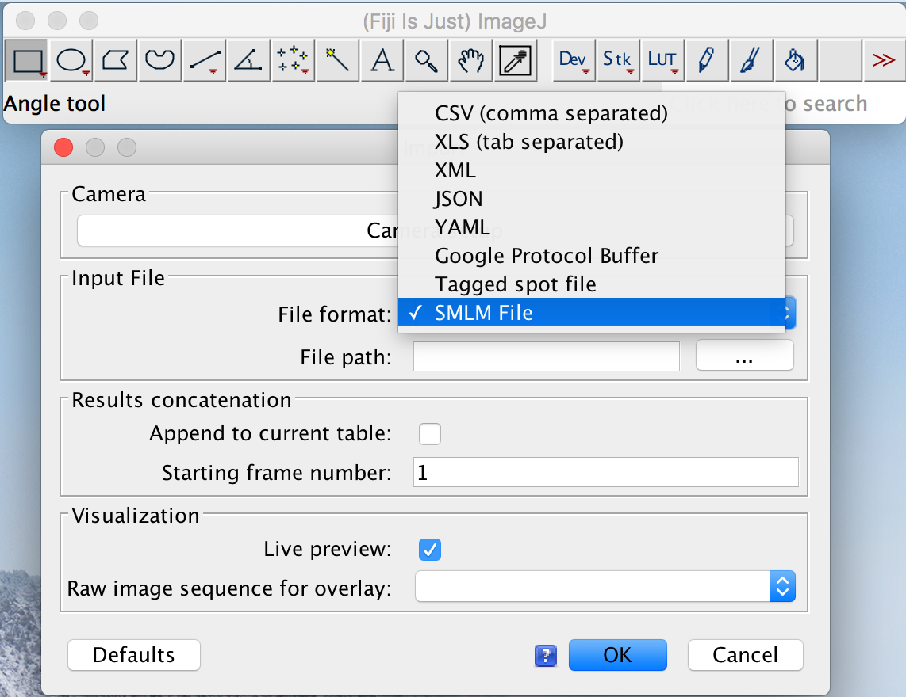

# Import and Export SMLM File in ThunderSTORM

**[Work In Progress]** available soon!

This is an ImageJ/ThunderSTORM plugin for adding SMLM file import/export support to ThunderSTORM.

Here is what you will see if you install this plugin in your ImageJ plugin folder.




## Installation

* First, please make sure you have the thunderSTORM plugin installed, if not, just Download a jar file from [here](https://github.com/zitmen/thunderstorm/releases/tag/v1.3) and copy it to your ImageJ plugin folder.
* Then download the plugin from here and copy it to your ImageJ folder

## Usage

Once the plugin is installed, you will see a new option in the dialog of `ThunderSTORM/Import/Export/Import results` named `SMLM File`.

The usage is exactly the same as you will do with thunderSTORM, just select `SMLM File` when you selected a .smlm file to import, or you want to save as the `SMLM File` format.

## For developers

In case you want to build the plugin, clone this git repository, make sure you have `JDK` and `Maven` installed. Then do the following:

```
cd Implementations/Java/ThunderSTORM
sh make_package.sh
```

This will create a jar file in a folder named `target`, which you can then used in ImageJ.
