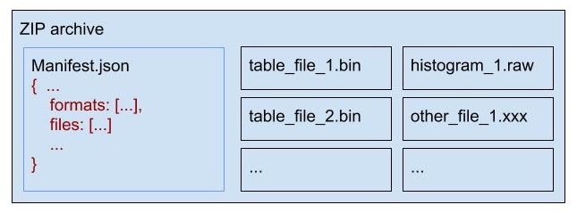
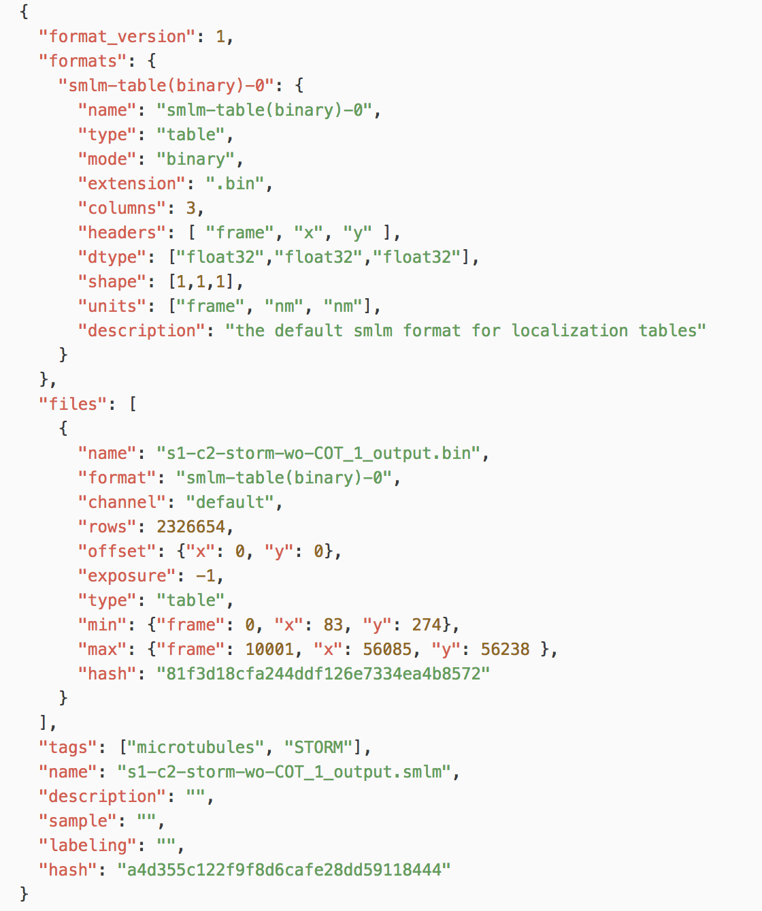

## Specification for the SMLM format (version 0.2.0)
**Note: this is a draft, APIs may change in future verisons.**

### Overview

The `SMLM` format is designed for storing and sharing Single Molecule Localization Microscopy (SMLM) data, the overall goal of this file format is to have a portable, flexible and extendable file format for research purposes.

The format is designed for the following scenarios:

* Exchanging, sharing and storing localization tables, with one `SMLM` file, it can store:
  * single-channel with single table
  * multi-channel with multiple table
  * tiled scanning (e.g. whole-slide with many fields of view)
* Saving raw images with localization tables
* Saving multi-channel images form other modalities (e.g. widefield ) with localization tables


By design, the SMLM file format use zip archive to group multiple files and describe them in a text file called `manifest.json`. It also defines how the SMLM-compatible software should read these files with a set of file formats. During saving, the localization table will be first represented with data types such as `32-bit float` or `32-bit unsigned integer`, and then being serialized into a binary file. All these files including binary files and `manifest.json` file which contain information about a single localization table, multiple localization table, or even with raw images are zipped and compressed into a zip archive and write to the file system. The zip file is then being renamed into a file with the `.smlm` extension.


### The ZIP archive
For implementing this specification, a standard zip format with DEFLATE compression algorithm must be supported and used by default. However, since the standard ZIP file can only save files which are smaller than 4GB, a full implementation of this specification should also support ZIP64 format in order to store files more than 4GB.

All other implmentation details about the ZIP archive should strictly follow the [.ZIP File Format Specification](https://pkware.cachefly.net/webdocs/casestudies/APPNOTE.TXT).

In the zip archive, it should at least contain a text file encoded with UTF-8 named `manifest.json`. It should be placed in the root directory of the archive. Other files can be placed any where in archive with any type of organization. Files in the same archive should be referred within the `manifest.json` by using relative file paths. File paths should be separated with `/`, and `.` can be used as the root directory of the ZIP archive. Other details about how file path should refer to the [RFC3986](https://tools.ietf.org/html/rfc3986) standard.



### Definition of `manifest.json`

The content of `manifest.json` file should be encoded with `UTF-8` encoding, and formated according to the JSON format defined by [RFC8259](https://tools.ietf.org/html/rfc8259).
#### Basic structure
A supported manifest file should contain fields shown below:
```javascript
{
  // Required
  "format_version": "0.2",
  "formats": {"smlm-table(binary)": {
    // Required
    "name": "smlm-table(binary)",
    "type": "table",
    "mode": "binary",
    "columns": 5,
    "headers": ["frame", "x", "y", "z", ..., "raw-patch"],
    "dtype": ["uint32", "float32", "float32", "float32", ..., "uint32"],
    "shape": [1, 1, 1, 1, ..., [40, 40]],
    "units": ["frame", "nm", "nm", "nm", ..., "photon"],
    // Optional
    "description": "the default smlm format for localization tables"
  }},

  "files": [{ ... FILE1_INFO ...},
            { ... FILE2_INFO ...},
            ...],

  // Recommended
  "name": "my storm file",
  "description": "example STORM data in .smlm format",
  "tags": [],
  "thumbnail": "xxxx.png",
  "sample": "Hela cells",
  "labeling": "Alexa 647",
  "date": "2018-2-3",

  // Optional
  "author": ...,
  "citation": ...,
  "email": ...,

  // Other information
  ...
}
```

#### File formats

The default table format (binary)
```javascript
{
  // Required
  "type": "table",
  "mode": "binary",
  "extension": ".bin",
  // define how to read each column
  // note: the following fields must have the length defined by 'columns'
  "columns": 5,
  "headers": ["frame", "x", "y", "z", ..., "raw-patch"],
  // specify dtype for each column
  "dtype": ["uint32", "float32", "float32", "float32", ..., "uint32"],
  // specify the length or shape for each column
  "shape": [1, 1, 1, 1, ..., [40, 40]]
  "units": ["frame", "nm", "nm", "nm", ..., "photon"]

  // Optional
  "name": "smlm-table(binary)",
  "description": "the default smlm format for localization tables"
}
```

In some cases, you may want to include an image, maybe from widefield or a mask annotation.
JEPG and PNG formats can used by set the type field of those files to "jpg" or "png". Both types support 8-bit image, for 16-bit, use PNG format.

If higher precision is desired, a raw pixel binary format can be defined:

image format(binary)
```javascript
{
  // required
  "type": "image",
  "mode": "binary",
  "extension": ".raw",
  "dtype": "uint32",
  "shape": [512, 512, null],
  "offset": 0,

  // Optional
  "name": "smlm-image(binary)",
  "description": "a format for 32-bit raw pixel image"
}
```
#### `manifest.json` example



#### Data types

| dtype        | range           | description  |
|:--------- |:-----------------|:------- |
| ~~int8~~   | -128 to 127 | 8-bit two's complement signed integer |
| uint8  | 0 to 255 | 8-bit unsigned integer |
| ~~int16~~  | -32768 to 32767 | 16-bit two's complement signed integer |
| uint16 | 0 to 65535  | 16-bit unsigned integer |
| ~~int32~~  | -2147483648 to 2147483647 | 32-bit two's complement signed integer |
| uint32 | 0 to 4294967295  | 32-bit unsigned integer |
| float32  | 1.2x10-38 to 3.4x1038 | 32-bit IEEE floating point number ( 7 significant digits e.g. 1.1234567) |
| float64 | 5.0x10-324 to 1.8x10308 | 64-bit IEEE floating point number (16 significant digits e.g. 1.123...15) |

To simplify the implementation of this Specification, we removed several data types with the consideration of use frequency in images(e.g. int8, int16 and int32). Instead, we will use the 'offset' in file information to apply a negative offset such that you will get an equivalent signed number. This would implies that for the implementation a signed type should be used during rendering or calculation, also it overflow should be considered. For example, if the file contains a uint32 column, after applying an offset(possibly negative), one will need float32 storage that column to prevent overflow.

Keep in mind also, the impact of file size on choosing data types can be reduced since we will use compression to produce the final file.


#### Built-in headers

Required headers:
 * x, y

Optional headers:
 * frame, z, intensity, time, channel, slice, pos, fluorophore_type, cluster, intensity_units, background, width, a, theta, x_original, y_original, z_original, x_precision, y_precision, z_precision, x_position, y_position

Unit of each header can be specified in the "units" field of the format definition. All headers have the unit of 1 by default, except for length related headers such as x, y, z are assumed in nm by default (if higher precision is needed, use float32 or float64 for storage but still keep the nm as unit). It's necessary for an implementation to handle at least nm based implementation and verify whether the unit is set to nm, otherwise it should raise error message if not able to do conversion.

Length unit must be those code defined by [SI system](https://en.wikipedia.org/wiki/Template:Convert/list_of_units/length), they should only contain ASCII letters, such that for Å should use 'angstrom' and 'μm' should be converted to 'um'.

Optional headers are recommended to keep inline with [tsf format](https://micro-manager.org/wiki/Tagged_Spot_File_(tsf)\_format)

#### Text exporting and import supporting
A smlm implemetation is recommended to support importing text based table, and should by default export as the smlm binary format. However, in order to work with existing software, one can still include their text format file along with the manifest file. Such that the zip file can be read by smlm compatible software, and also can be easily unzipped to text format which supported by other software.

You can export as a native smlm-table(csv) format:
```javascript
{
  // Required
  "type": "table",
  "mode": "text",
  "extension": ".csv",
  "dtype": "float32",
  "delimiter": ",",
  "comments": "#",

  // specify which row is the header, set to -1 if there is no header
  "header_row": 0,
  // specify how to transform the headers to the standard header defined in smlm format,
  "header_transform": {},

  // Optional
  "name": "smlm-table(csv)",
  "description": "a format for export as csv format"
}
```

Define a new text table format
```javascript
{
  // Required
  "type": "table",
  "mode": "text",
  "extension": ".csv",
  "dtype": "float32",
  "delimiter": ",",
  "comments": "",

  // specify which row is the header, set to -1 if there is no header
  "header_row": 0,
  // specify how to transform the headers to the standard header defined in smlm format,
  "header_transform": {"x [nm]":"x", "y [nm]":"y", "z [nm]":"z"},

  //if no header row, use index to specify the transform
  "header_row": -1,
  "header_transform": {0: "frame", 1:"x", 2:"y", 3:"z"},

  // Optional
  "name": "ThunderSTORM(csv)",
  "description": "a csv format used in thunderSTORM"
}
```

Notice that if you are using a text format, you should not use .smlm extension, instead, a .zip format should be used.

#### File info
```javascript
{
  //Required
  "name": "table1.bin",
  "type": "table",
  "format": "smlm-table(binary)",
  "channel": "alexa647"
  "rows": 102300,
  // specify offsets for column(s), if need. set to {} if no offset needed.
  "offset": {'x':14, 'y':12 },

  //Optional
  "exposure": 20,
}
```

For other types of image files:
```javascript
{ "name": "widefield-1.png",
  "type": "image",
  "format": "png",
  "channel": "widefield"
  // specify offsets for column(s), if need. set to {} if no offset needed.
  "offset": {'x':14, 'y':12 },

  // Optional
  "exposure": 100,
}
```

To use the a raw image format, just change the "format" field to the name of the format you defined.

```javascript
{ "name": "widefield-2.bin",
  "type": "image",
  "format": "smlm-image(binary)",
  "channel": "widefield"
  // specify offsets for column(s), if need. set to {} if no offset needed.
  "offset": {'x':14, 'y':12 },

  // Optional
  "exposure": 100,
}
```
